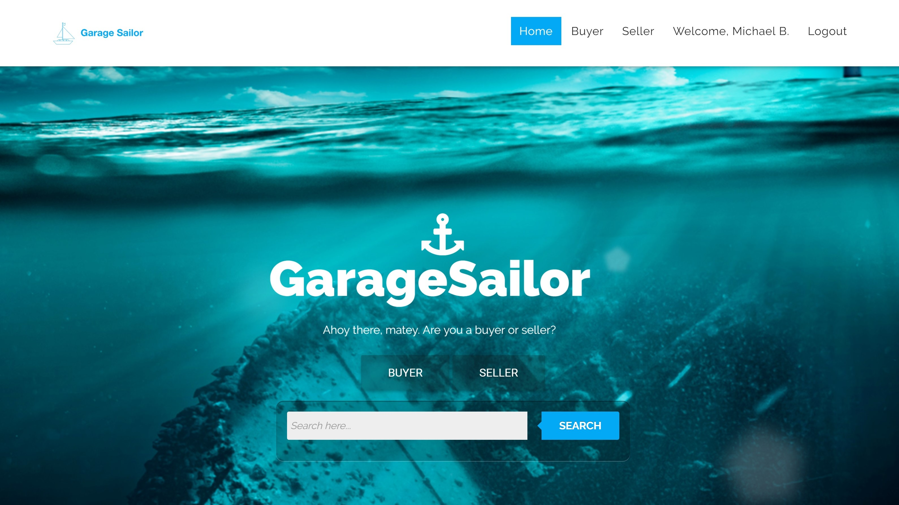

<h1>Garage Sailor</h1>

Live version: https://garage-sailor.herokuapp.com/

Authors: Michael Benefiel, Dustin Watkins, Billy Hodes, Josh Ragon

<h2> Full demo | Click below </h2>

<h2> About Garage Sailor</h2>
Are you looking for a garage sale, or trying to promote your own? Well Garage Sailor is the app for you! Garage Sailor shows garage sales in your area with information about locations, items and prices. It is the perfect way to find that piece of furniture you've been looking for at a bargain price. Garage Sailor is easy to use: Just specify whether you are a buyer or seller and begin sailing! You can add items to your cart so you can keep track of which garage sales are on your radar.

<h2> Why use Garage Sailor? </h2>

- Sellers can advertise their garage sale to a greater audience

- Simple interface

- Buyers can see items at a garage sale without leaving home

- Keep track of the items you want and where they are

<h2> Future development </h2>

- Garage "Sailors" are the future. 

- The "Sailors" will bridge the gap between the traditional old-fashioned garage sale and the online shopping community.  Just because someone has a garage sale, doesn't mean they have the time, means, or even just the desire, to post all of their things online.  The "sailor" takes care of that for them by posting items they find while out garage sailing.  

- There is an opportunity to incentivize sailors to improve their skills once the app gains traction. 

- Buyers will be able to "follow" their favorite sellers or sailors, and even ask for them to be on the lookout for their specific treasures. 

<h2>Technologies used</h2>

HTML/CSS/Javascript - Garage Sailor was built using these core technologies. Both hand-crafted code and robust libraries were used to create the features necessary to give Garage Sailor a modern style, with an easy-to-use experience.  

Bootstrap - The elegant style and feel of Garage Sailor incorporates several of the styling tools pioneered and perfected by Bootstrap 

Materialize - Created and designed by Google, Material Design is a design language that combines the classic principles of successful design along with innovation and technology. 

jQuery - Much of the smooth interactivity of Garage Sailor is put into motion with jQuery.  Moving information to and from relational databases is made much smoother with the use of jQuery.    

AJAX - Piggybacking off of jQuery, AJAX is invaluable to communicating with the hand-tailored Garage Sailor API.

JSON - Communication between servers, relational databases, and front-end rendering relies heavily on the constructing and parsing of JSON objects.  

Handlebars - Garage Sailor is held together by a Handlebars framework that was carefully crafted to suit the needs of an interactive experience necessary to make Garage Sailor a reality.

Heroku - Garage Sailor is now accessible from anywhere in the universe that has access to the world wide web thanks to the Heroku cloud platform and their willingness to aid developers by allowing for free and easy app deployment.

JawsDb - All the data needed to deliver the experience to the Garage Sailor is housed inside of JawsDb.

MySQL - All data creation and manipulation takes place using the MySQL dialect 

Sequelize - Connections, data handling and delivery, and database management is handled using the Sequelize library. 

Node - Servers were built on the Node.js platform. Using an open-source, cross-platform JavaScript run-time environment allowed us to customize many available libraries to suit Garage Sailor.

Express - Express was chosen for it's fast, unopinionated, and minimalist qualities as our web framework for Garage Sailor.

Git - As with all projects, Git remains invaluable to the creation, devlopment, communication, and support of Garage Sailor.

Trello - Our team systematically set project goals, created and met deadlines, shared ideas, and coordinated efforts with the help of Trello.

<h2>Product Features</h2>

- Welcome to Garage Sailor! Conveniently log in.

- Are you a buyer or a seller? Choose your destination. 

- As a seller, start by entering your garage sale information and click "submit garage sale information". 

- Next, enter your item information. This has been pushed to the buyer page for others to view.

- Are you interested in visiting a garage sale, or purchasing items? Visit the buyer page!

- Select a garage sale near you to view more details. Like what you see? Add it to your boat for future sailing (to visit later).
    - In future development, you will be able to 'set sail' and view the garage sale location on GoogleMaps. 

